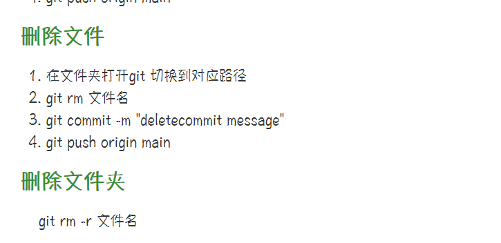

# github命令

上传之前先拉取更新文件避免不同步

##  进行下拉更新

```
git pull origin main
```

### 拉取文件夹下文件信息

```
ls 
```

### 返回上一级目录

```
cd .. 
```

### 上传文件流程

1. 在文件夹打开git 切换到对应路径
2. git add 文件名（多个文件可以多次提交  全部提交是add .）
3. git commit -m "Your commit message"
4. git push origin main

### 删除文件

1. 在文件夹打开git 切换到对应路径
2.  git rm 文件名
3. git commit -m "deletecommit message"
4. git push origin main

### 删除文件夹

​	git rm -r 文件名




# 如何使用git（同一账号）在多台电脑协同做工

使用场景，对于需要对同一个文档需要在多台电脑上进行编辑工作又不想通过U盘的方式拷贝来拷贝去，比如在学校使用的笔记本电脑，在家中使用台式机。在这种情况下就可以使用git+github来完成协同工作的任务

## 使用步骤

1、在你想要协同的工作文件夹中打开Git Bash Here，创建一个SSH key，这里用到了非对称公钥加密体系，生成的公钥放到github的网站上，二生成的私钥放在自己的电脑上，每当需要将文件上传到github上时，服务器就会用事先的公钥与你给出的私钥进行验证，验证是否是真正的用户在操作（原理类似于数字签名）。通过如下命令生成公私钥：

```
ssh-keygen -t rsa -C "你的github邮箱"
```

2、将公钥添加到github自己的网站设置上，注意格式（打开的id_rsa.hub文件中不要将最后的邮箱也复制上去，这一点注意看github上的添加英文提醒）

3、然后我们在自己希望上传的文档的文件夹中打开git bash，初始化git仓库并作出添加提交，并需要进行一定的配置等命令，输入命令：

```
git init

git config --global user.name"自己账户的名字，建议就是github上的账户名，这样好记"
git config --global user.email"自己账户的邮箱地址，建议也是用GitHub上的那个"

git config --global -l //这条命令是用来查看上面的信息是否之前已经被输入了，自己检查下

git add .   //将所有的文件加入到index进行缓存
git commit -m "你想加入的备注"  //将所有的文件提交到仓库当中

```

